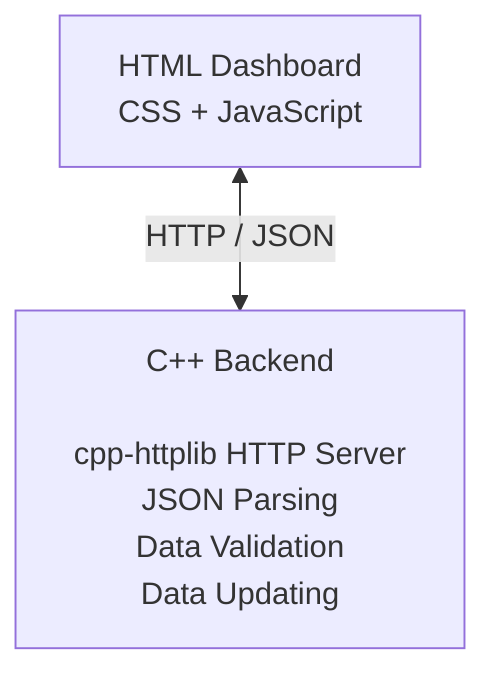
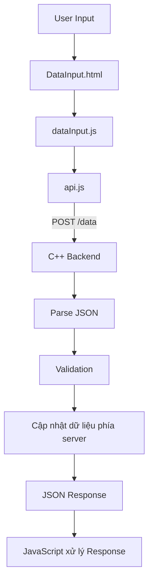
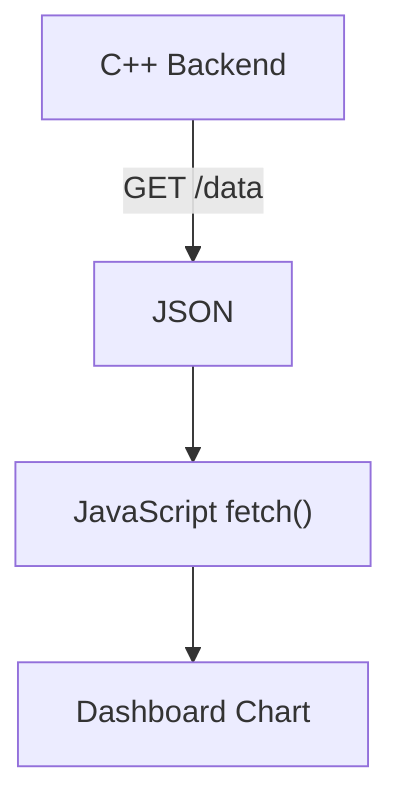
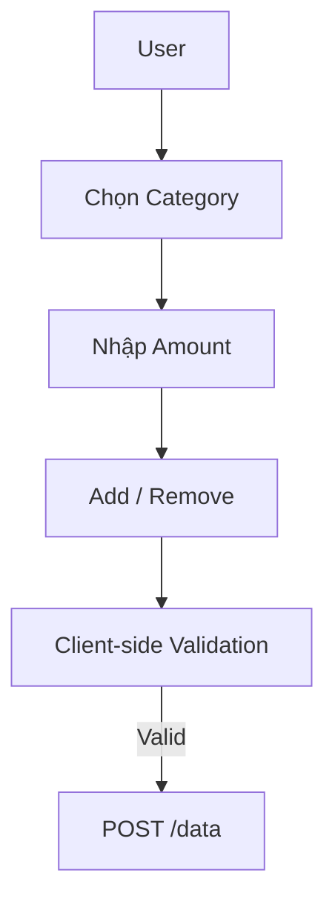
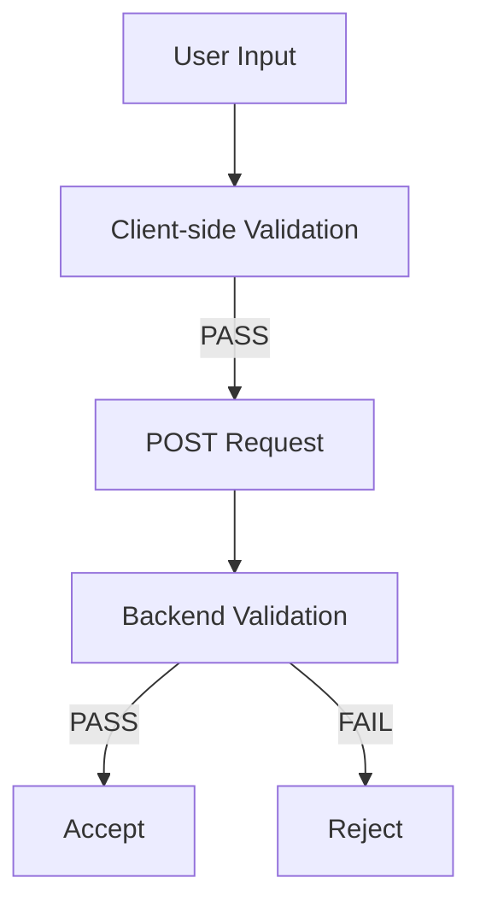
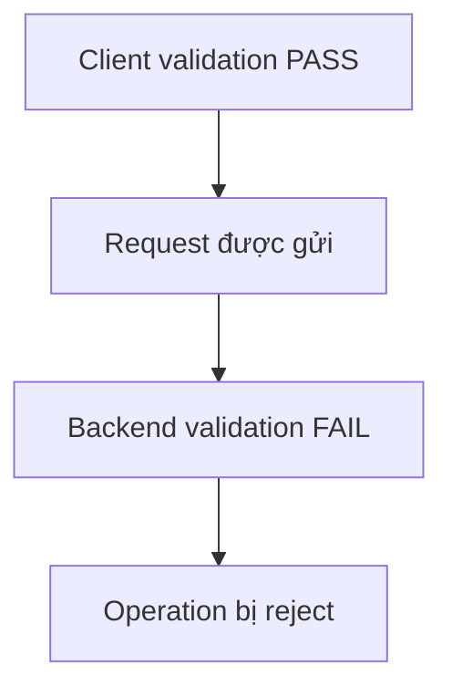
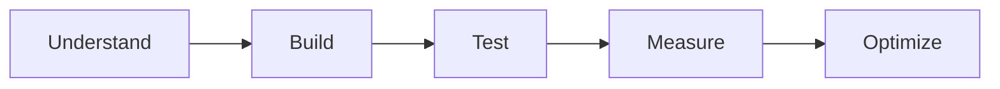
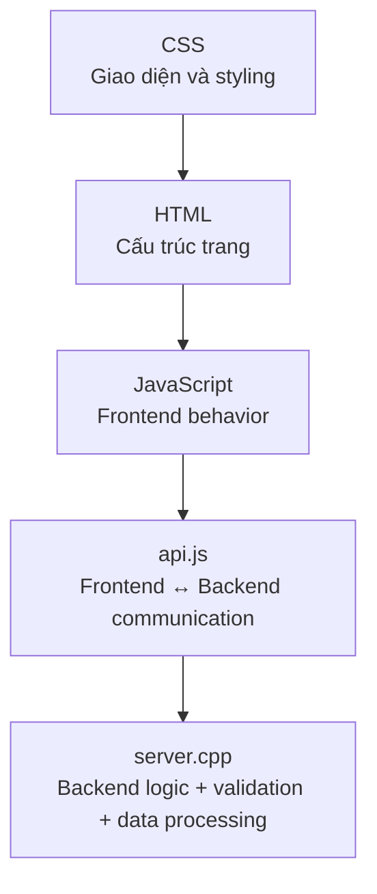

# DASA — Warehouse & Order Management

## 1. Nội dung dự án

> **Trạng thái: Chưa triển khai**

Dự án hướng tới việc xây dựng một hệ thống **Warehouse & Order Management**.

Phần nghiệp vụ cụ thể, logic quản lý kho, quản lý đơn hàng và cấu trúc dataset **chưa được xác định và triển khai ở giai đoạn hiện tại**.

Phần này sẽ được cập nhật khi dự án bắt đầu bước vào giai đoạn phát triển business logic.

---

## 2. Tổng quan dự án

Ở giai đoạn hiện tại, dự án tập trung xây dựng **nền tảng kỹ thuật** cho hệ thống.

Kiến trúc chính gồm:

- **C++ Backend** — xử lý dữ liệu phía server, validation và cập nhật dữ liệu.
- **HTML/CSS/JavaScript Frontend** — xây dựng giao diện dashboard và giao tiếp với backend thông qua HTTP.
- **JSON** — định dạng dữ liệu trao đổi giữa frontend và backend.
- **HTTP API** — cung cấp các endpoint để frontend giao tiếp với C++ backend.

### Kiến trúc hiện tại



### Luồng dữ liệu hiện tại

#### Cập nhật dữ liệu



#### Lấy dữ liệu cho Dashboard



---

## 3. Cấu trúc thư mục hiện tại

```text
DASA/
│
├── index.html
├── DataInput.html
│
├── CSS/
│   └── style.css
│
├── JavaScript/
│   ├── app.js
│   ├── header.js
│   ├── navbar.js
│   ├── sidebar.js
│   ├── dashboardChart.js
│   ├── dataInput.js
│   └── api.js
│
└── cpp/
    ├── server.cpp
    ├── httplib.h
    └── json.hpp
```

---

# 4. Chức năng của từng file

## Root

### `index.html`

Trang Dashboard chính của hệ thống.

Chức năng:

- Xây dựng cấu trúc HTML của Dashboard.
- Chứa khu vực nội dung chính.
- Chứa các container dành cho chart và các thành phần hiển thị dữ liệu.
- Load các JavaScript module cần thiết.
- Khởi tạo các thành phần giao diện dùng chung.

---

### `DataInput.html`

Trang nhập và cập nhật dữ liệu.

Chức năng:

- Cung cấp giao diện nhập dữ liệu.
- Cho phép chọn `category`.
- Cho phép nhập `amount`.
- Cung cấp thao tác **Add** và **Remove**.
- Load các JavaScript cần thiết để giao tiếp với backend.

Luồng hiện tại:



---

# 5. CSS

## `CSS/style.css`

File CSS dùng chung cho frontend.

Chức năng:

- Styling cho layout của Dashboard.
- Styling cho sidebar.
- Styling cho header/navbar.
- Các style dùng chung cho giao diện.

Ở giai đoạn hiện tại, một số styling riêng của từng chart có thể được đặt trực tiếp trong HTML nếu phù hợp.

---

# 6. JavaScript

## `JavaScript/app.js`

File dành cho các logic ở cấp độ application.

Chức năng:

- Xử lý các hành vi/layout chung của application.
- Chứa các logic không thuộc riêng một page hoặc component cụ thể.

**Chart logic không nên đặt trong file này.**

Chart logic được tách riêng trong:

```text
dashboardChart.js
```

---

## `JavaScript/header.js`

Xử lý component **Header**.

Chức năng:

- Tạo/load Header dùng chung cho các trang frontend.

---

## `JavaScript/navbar.js`

Xử lý component **Navbar**.

Chức năng:

- Tạo/load Navbar dùng chung cho các trang frontend.

---

## `JavaScript/sidebar.js`

Xử lý component **Sidebar**.

Chức năng:

- Tạo/load Sidebar.
- Xác định trạng thái navigation hiện tại.

Ví dụ:

```javascript
loadSidebar("home");
loadSidebar("dataInput");
```

---

## `JavaScript/dashboardChart.js`

Chứa logic liên quan đến các chart trên Dashboard.

Chức năng:

- Gửi request tới C++ backend để lấy dữ liệu.
- Nhận và xử lý JSON.
- Tách `labels` và `values` từ dữ liệu.
- Tạo và cấu hình chart.

Chart hiện tại sử dụng **Chart.js**.

Logic của chart được tách khỏi `app.js` để mỗi file giữ đúng trách nhiệm của nó.

---

## `JavaScript/dataInput.js`

Xử lý logic của trang `DataInput.html`.

Chức năng:

- Đọc input từ người dùng.
- Thực hiện client-side validation.
- Tạo request payload.
- Gửi thao tác Add/Remove thông qua `api.js`.
- Nhận và xử lý response từ backend.
- Hiển thị thông báo thành công/lỗi cho người dùng.

Payload hiện tại:

```json
{
  "category": "C",
  "amount": 50,
  "operation": "add"
}
```

Client-side validation là **lớp validation đầu tiên**.

Backend vẫn là nơi chịu trách nhiệm validation chính thức.

---

## `JavaScript/api.js`

Đây là lớp giao tiếp giữa frontend và backend.

**Lưu ý:** `api.js` không phải là một backend server và cũng không tạo ra một API server mới.

Nhiệm vụ của file này là tập trung các thao tác HTTP giữa JavaScript và C++ backend.

Chức năng hiện tại:

- Gửi HTTP request.
- Chuyển JavaScript object thành JSON.
- Nhận JSON response từ backend.
- Parse response để JavaScript sử dụng.

Endpoint cập nhật hiện tại:

```text
POST http://localhost:8080/data
```

---

# 7. C++ Backend

## `cpp/server.cpp`

File chính của backend/server.

Chức năng:

- Khởi động HTTP server.
- Định nghĩa các API endpoint.
- Lưu trữ dữ liệu hiện tại phía server.
- Parse JSON request.
- Validation request.
- Thực hiện các thao tác Add/Remove.
- Trả JSON response về frontend.

Server hiện tại chạy tại:

```text
http://localhost:8080
```

Các endpoint hiện tại:

```text
GET  /data
POST /data
```

---

### `GET /data`

Dùng để lấy dataset hiện tại từ server.

Ví dụ response:

```json
[
  { "category": "A", "value": 120 },
  { "category": "B", "value": 180 },
  { "category": "C", "value": 300 },
  { "category": "D", "value": 220 }
]
```

---

### `POST /data`

Dùng để gửi yêu cầu cập nhật dữ liệu.

Ví dụ request:

```json
{
  "category": "C",
  "amount": 50,
  "operation": "add"
}
```

Các operation hiện tại:

```text
add
remove
```

Backend sẽ validation request trước khi thực sự thay đổi dữ liệu.

Ví dụ:

```text
C = 300

remove 50
→ C = 250

remove 500
→ Reject
→ C vẫn = 300
```

**Một request được server nhận không có nghĩa operation đã được chấp nhận.**

---

## `cpp/httplib.h`

Single-header library của **cpp-httplib**.

Được sử dụng để xây dựng HTTP server trong `server.cpp`.

Được include bằng:

```cpp
#include "httplib.h"
```

---

## `cpp/json.hpp`

Single-header library của **nlohmann/json**.

Được sử dụng để parse và xử lý JSON ở C++ backend.

Được sử dụng bằng:

```cpp
#include "json.hpp"

using json = nlohmann::json;
```

---

# 8. Kiến trúc Validation

Project hiện tại sử dụng **hai lớp validation**.



## Client-side Validation

Được thực hiện trong:

```text
JavaScript/dataInput.js
```

Mục đích là phát hiện những input cơ bản không hợp lệ trước khi gửi request.

Ví dụ:

- Amount không phải số.
- Amount <= 0.
- Category không hợp lệ/không tồn tại ở phía client.

---

## Backend Validation

Được thực hiện trong:

```text
cpp/server.cpp
```

Backend là **nguồn validation có thẩm quyền** đối với dữ liệu.

Ví dụ:

- Amount phải lớn hơn 0.
- Category phải tồn tại.
- Operation phải hợp lệ.
- `remove` không được làm giá trị nhỏ hơn 0.

Do đó:



Đây là hành vi bình thường và cần được duy trì khi phát triển hệ thống.

---

# 9. Nguyên tắc phát triển

Project hiện tại được phát triển theo từng bước.

Nguyên tắc ưu tiên:



Không nên thêm các optimization hoặc architectural complexity khi chưa có nhu cầu thực tế.

Dataset `A/B/C/D` hiện tại chỉ là **prototype dataset** dùng để kiểm tra architecture và data flow.

Nó **không phải final business data model** của hệ thống.

---

# 10. Định hướng phát triển trong tương lai

Project cuối cùng dự kiến sẽ xử lý dataset lớn hơn đáng kể, có thể bao gồm:

- 1000+ records/elements.
- Nhiều attributes trên mỗi record.
- Các quan hệ dữ liệu phức tạp hơn.
- Warehouse management logic.
- Order management logic.

Khi dataset và business logic phát triển, các vấn đề có thể cần xem xét:

- Efficient data retrieval.
- Partial update.
- Filtering và querying.
- Pagination.
- Caching.
- Data aggregation.
- Frontend rendering performance.

Các vấn đề trên là **future considerations**, chưa phải yêu cầu của prototype hiện tại.

Không nên tối ưu chúng trước khi có requirement hoặc measurement thực tế.

---

# 11. Quy tắc phân chia trách nhiệm

Khi phát triển thêm project, nên duy trì separation of responsibilities:



Ví dụ:

- Không đưa business logic của C++ vào JavaScript nếu không cần thiết.
- Không đưa chart logic vào `app.js`.
- Không biến `api.js` thành một server mới.
- Backend vẫn phải tự validation request, không phụ thuộc hoàn toàn vào client-side validation.

---
