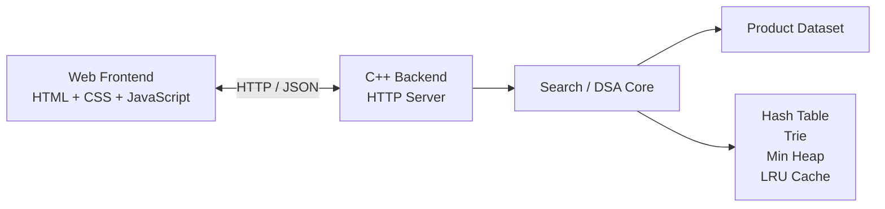
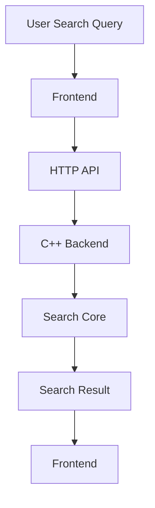
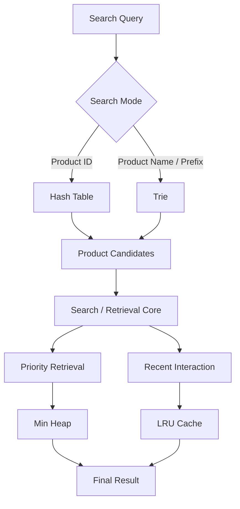

# DASA — Product Search & Retrieval System

## 1. Tổng quan dự án

DASA là hệ thống **Product Search & Retrieval System** được xây dựng với mục tiêu tìm kiếm và truy xuất sản phẩm từ dataset lớn, đồng thời áp dụng các **Data Structures & Algorithms (DSA)** được tự triển khai.

Project hiện tại gồm:

- C++ Backend xử lý search và retrieval.
- Web Frontend cung cấp giao diện tìm kiếm.
- Dataset sản phẩm gồm 10,000 và 100,000 records.
- 4 Data Structures / Algorithms được xây dựng cho hệ thống:
  - Hash Table
  - Trie
  - LRU Cache
  - Min Heap

Hiện tại phần HTTP server và frontend đã hoạt động. Phần **kết nối và phối hợp 4 DSA thành search pipeline hoàn chỉnh vẫn đang được phát triển**.

---

# 2. Kiến trúc hệ thống

Project được chia thành ba phần chính:



### Web Frontend

Cung cấp giao diện để:

- Nhập search query.
- Hiển thị autocomplete suggestions.
- Hiển thị search results.
- Hiển thị các sản phẩm được tương tác gần đây.

### C++ Backend

Đóng vai trò HTTP server và xử lý request từ frontend.

Backend hiện cung cấp các API phục vụ:

- Search input.
- Autocomplete.
- Search result.
- Recent interacted products.

### Search / DSA Core

Đây là phần đang được phát triển.

Nó sẽ chịu trách nhiệm xác định cách các DSA được sử dụng và phối hợp để xử lý search và retrieval.

---

# 3. Giao diện hiện tại

Frontend hiện tại gồm:

- Search bar.
- Search button.
- Autocomplete suggestion box.
- Retrieval Results.
- Recent Workspace.


### Retrieval Results

Hiển thị các sản phẩm được trả về từ search.

Thông tin hiện tại gồm:

- Order
- Product ID
- Product Name
- Made Date
- Arrived Time
- Best By Date
- Status

### Recent Workspace

Hiển thị các sản phẩm được tương tác gần đây thông qua LRU Cache.

Thông tin hiện tại gồm:

- Order
- Product ID
- Product Name
- Operation
- Time

---

# 4. Search System

Project hiện hỗ trợ hai search mode chính:

### Product ID Search

Sử dụng product ID để tìm kiếm chính xác một sản phẩm.

User-facing convention:

```text
#P00005
```

Search này được thiết kế để sử dụng **Hash Table** trong phiên bản hoàn chỉnh.

### Product Name Search

Cho phép tìm sản phẩm dựa trên tên.

Autocomplete cũng được cung cấp khi user nhập prefix của product name.

Ví dụ:

```text
lap
```

có thể đưa ra suggestion:

```text
Laptop Stand
```

Autocomplete được thiết kế để sử dụng **Trie** trong phiên bản hoàn chỉnh.

---

# 5. Backend API

Backend hiện có 6 endpoint chính:

```text
GET  /product/recent
POST /product/add
DELETE /product/delete
POST /search/input
GET  /search/autocomplete
GET  /search/result
```

### `POST /search/input`

Nhận search string hiện tại từ frontend.

Endpoint này chỉ cập nhật search query hiện tại; việc xử lý search result được thực hiện thông qua search-result workflow.

### `GET /search/autocomplete`

Nhận một prefix và trả về các product-name suggestions.

```text
/search/autocomplete?prefix=lap
```

### `GET /search/result`

Trả về search result hiện tại.

### `GET /product/recent`

Trả về danh sách các sản phẩm được tương tác gần đây từ LRU Cache.

### `POST /product/add`

Nhận thông tin sản phẩm và `quantity`. Backend tạo đúng số sản phẩm được yêu
cầu; mỗi sản phẩm nhận một ID riêng và không lưu `quantity` trong `Product`.

### `DELETE /product/delete`

Xóa đúng một sản phẩm theo ID.

---

# 6. Data Structures & Algorithms

Các DSA được đặt trong:

```text
cpp/DSAcore/
```

Project hiện có 4 implementation chính:

```text
Hash Table
Trie
LRU Cache
Min Heap
```

---

## 6.1 Hash Table

Location:

```text
cpp/DSAcore/hashtable/
```

Hash Table được **xây dựng từ scratch** cho workflow tìm kiếm sản phẩm theo ID.

### Input

```text
product_id
```

### Output

```text
Product
```

Ví dụ:

```text
P00005
   ↓
Product
```

Hash Table được thiết kế chuyên biệt cho product-ID workflow.

Nó không được sử dụng bên trong LRU Cache vì LRU Cache cần một lookup structure tổng quát hơn; LRU hiện sử dụng `unordered_map` của C++ kết hợp với doubly linked list tự xây dựng.

---

## 6.2 Trie

Location:

```text
cpp/DSAcore/trie/
```

Trie được **xây dựng từ scratch** để xử lý prefix-based search và autocomplete.

### Input

```text
string prefix
```

### Output

```text
vector<string> product_id
```

Trie được sử dụng để tìm các product phù hợp với prefix của search query.

Ví dụ:

```text
"lap"
   ↓
Trie
   ↓
Matching products
```

---

## 6.3 LRU Cache

Location:

```text
cpp/DSAcore/LRU_Cache/
```

LRU Cache dùng để lưu lại **N sản phẩm được tương tác gần đây nhất**.

LRU được xây dựng bằng:

- Doubly linked list tự implement.
- `unordered_map` của C++.

### Input

```text
Product + operation
```

### Output

```text
vector<Product>
```

theo thứ tự từ **most recently used** đến **least recently used**.

LRU Cache hiện đang được sử dụng bởi backend để xây dựng **Recent Workspace**.

---

## 6.4 Min Heap

Location:

```text
cpp/DSAcore/Min_heap/
```

Min Heap được **xây dựng từ scratch** để phục vụ workflow retrieval dựa trên priority.

### Input

```text
product_name
```

### Output

```text
vector<Product>
```

Vai trò cuối cùng của Min Heap trong hệ thống vẫn đang được team đánh giá và có thể thay đổi khi search workflow hoàn thiện.

---

# 7. DSA Requirement

Một trong các requirement của project là phải có **ít nhất 2 Data Structures được xây dựng từ scratch**.

Project hiện tại đã có 4 implementation:

```text
Hash Table
Trie
LRU Cache
Min Heap
```

Trong đó:

- Hash Table được xây dựng từ scratch.
- Trie được xây dựng từ scratch.
- Doubly Linked List bên trong LRU Cache được xây dựng từ scratch.
- Min Heap được xây dựng từ scratch.

Các container có sẵn của C++ như `vector` và `unordered_map` chỉ được sử dụng như những thành phần hỗ trợ, không thay thế cho các DSA chính được project implement.

---

# 8. Benchmark Dataset

Project hiện có hai dataset:

```text
cpp/product_inventory_10 000.csv
cpp/product_inventory_100 000.csv
```

| Dataset                         | Số lượng sản phẩm |
| ------------------------------- | ----------------: |
| `product_inventory_10 000.csv`  |            10,000 |
| `product_inventory_100 000.csv` |           100,000 |

Các dataset hiện tại được sử dụng cho mục đích **benchmark và đánh giá search system**.

Dataset hiện đang ở trạng thái **read-only**.

Hệ thống chưa có chức năng chỉnh sửa hoặc ghi ngược dữ liệu vào CSV.

---

# 9. Current Search Flow

Search flow hiện tại được xây dựng theo hướng:



Trong phiên bản hiện tại, `server.cpp` vẫn sử dụng search logic tạm thời để kiểm tra frontend/backend architecture.

Ví dụ, search hiện tại có thể trực tiếp duyệt product list để tìm product phù hợp.

Các DSA đã được implement nhưng **chưa được tích hợp hoàn chỉnh vào search core**.

---

# 10. Planned DSA Integration

Kiến trúc dự kiến sẽ kết hợp các DSA như sau:



Chi tiết về cách các DSA sẽ phối hợp vẫn chưa được finalized.

Phần này là **main unfinished component** của project hiện tại.

---

# 11. Current Limitations

Các phần hiện chưa hoàn thiện:

### DSA Integration

4 DSA chưa được kết nối thành một search/retrieval pipeline hoàn chỉnh.

### Filtering

Filtering theo range hoặc các thuộc tính sản phẩm chưa được triển khai.

### Pruning

Search-space pruning hiện đang được cân nhắc nhưng chưa được implement.

### Dataset Modification

Dataset CSV hiện chỉ được sử dụng để đọc dữ liệu.

Chưa có chức năng:

- Add product.
- Remove product.
- Update product.
- Persist thay đổi vào dataset.

### Min Heap Workflow

Vai trò chính xác của Min Heap trong retrieval workflow vẫn có thể được thay đổi sau khi team thống nhất search design.

---

# 12. Project Structure

```text
DASA/
│
├── cpp/
│   │
│   ├── DSAcore/
│   │   ├── hashtable/
│   │   │   ├── hashtable.cpp
│   │   │   ├── hashtable.h
│   │   │   └── hashtabletest.cpp
│   │   │
│   │   ├── LRU_Cache/
│   │   │   ├── LRU_Cache.h
│   │   │   └── LRU_CacheTest.cpp
│   │   │
│   │   ├── Min_heap/
│   │   │   ├── Min_heap.cpp
│   │   │   ├── Min_heap.h
│   │   │   └── Min_heaptest.cpp
│   │   │
│   │   ├── trie/
│   │   │   ├── trie.cpp
│   │   │   ├── trie.h
│   │   │   └── trietest.cpp
│   │   │
│   │   └── Product.h
│   │
│   ├── src/
│   │   ├── httplib.h
│   │   └── json.hpp
│   │
│   ├── product_inventory_10 000.csv
│   ├── product_inventory_100 000.csv
│   ├── server.cpp
│   └── server.exe
│
└── web/
    │
    ├── CSS/
    │   └── style.css
    │
    ├── JavaScript/
    │   ├── api.js
    │   └── app.js
    │
    └── index.html
```

---

# 13. Development Status

| Component               | Status             |
| ----------------------- | ------------------ |
| Web Interface           | ✅ Implemented     |
| C++ HTTP Server         | ✅ Implemented     |
| Product Model           | ✅ Implemented     |
| 10,000 Product Dataset  | ✅ Available       |
| 100,000 Product Dataset | ✅ Available       |
| Hash Table              | ✅ Implemented     |
| Trie                    | ✅ Implemented     |
| LRU Cache               | ✅ Implemented     |
| Min Heap                | ✅ Implemented     |
| Product ID Search       | 🟡 Prototype       |
| Product Name Search     | 🟡 Prototype       |
| Autocomplete            | 🟡 Prototype       |
| DSA Integration         | 🔴 In Progress     |
| Filtering               | 🔴 Not Implemented |
| Pruning                 | 🔴 Not Implemented |
| Dataset Modification    | 🔴 Not Implemented |

---

# 14. Future Development

The next major step is to complete the **Search / DSA Core** and determine how the four implemented structures should interact.

Potential future features include:

- Trie-based autocomplete.
- Hash Table-based exact ID search.
- Priority-based retrieval using Min Heap.
- Real search interactions updating the LRU Cache.
- Search filtering.
- Search-space pruning.
- Benchmarking across 10,000 and 100,000 products.
- Search-time measurement.
- Displaying the currently active benchmark dataset.

These features will be added according to the final requirements and search workflow agreed upon by the team.
